# GreenWave Recorder Architecture

 codex/determine-mobile-app-build-capability-h1begz
GreenWave Recorder is an async Python 3.12+ platform for discovering, recording, and analyzing city camera video streams from browser-rendered public sites. This document defines the implementation target and tracks the current Phase 1 baseline.
=======
GreenWave Recorder is an async Python 3.12+ platform for discovering, recording, and analyzing city camera video streams from browser-rendered public sites. This document defines the approved implementation target before code is written.
main

## Goals

- Discover camera streams with a real Chromium browser controlled by Playwright and Chrome DevTools Protocol (CDP).
- Capture HTTP, Fetch, XHR, WebSocket, Media, Manifest, ServiceWorker, redirects, cookies, storage, and JavaScript-generated traffic.
- Detect HLS, Low Latency HLS, DASH, RTSP, RTMP, FLV, WebRTC, MJPEG, MP4 live, and unknown video-like streams.
- Verify playlists and segments, infer metadata, persist findings to SQLite, and export `cameras.json`.
- Keep the codebase modular enough for later Recorder, Analyzer, Traffic Light Detector, Web UI, and REST API phases.

## Target Directory Tree

```text
greenwave-recorder/
├── pyproject.toml
├── README.md
├── cameras.json
├── docs/
│   └── architecture.md
├── greenwave/
│   ├── __init__.py
│   ├── cli.py
│   ├── config.py
│   ├── logging.py
│   ├── discover/
│   │   ├── __init__.py
│   │   ├── engine.py
│   │   ├── browser.py
│   │   ├── cdp.py
│   │   ├── traffic.py
│   │   ├── classifier.py
│   │   ├── verifier.py
│   │   └── exporter.py
│   ├── crawler/
│   │   ├── __init__.py
│   │   ├── crawler.py
│   │   ├── page_actions.py
│   │   └── link_extractor.py
│   ├── recorder/
│   │   ├── __init__.py
│   │   └── interfaces.py
│   ├── analyzer/
│   │   ├── __init__.py
│   │   └── interfaces.py
│   ├── database/
│   │   ├── __init__.py
│   │   ├── connection.py
│   │   ├── schema.py
│   │   └── repositories.py
│   ├── models/
│   │   ├── __init__.py
│   │   ├── camera.py
│   │   ├── stream.py
│   │   ├── traffic.py
│   │   └── database.py
│   ├── utils/
│   │   ├── __init__.py
│   │   ├── urls.py
│   │   ├── media.py
│   │   └── time.py
│   └── web/
│       ├── __init__.py
│       └── interfaces.py
└── tests/
    ├── conftest.py
    ├── discover/
    ├── crawler/
    ├── database/
    └── fixtures/
```

## Dependencies

Runtime:

- Python `>=3.12`.
- `playwright` for Chromium automation and CDP access.
- `aiohttp` for async playlist, segment, manifest, and probe downloads.
- `pydantic` and `pydantic-settings` for validated models and configuration.
- `typer` for CLI commands.
- `rich` for terminal output.
- `structlog` for structured logs.
- `aiosqlite` for async SQLite access.

Development:

- `pytest`, `pytest-asyncio`.
- `ruff`.
- `mypy`.
- `uv` as the package and environment manager.

## Module Dependencies

```text
cli
 ├── config
 ├── logging
 ├── discover.engine
 ├── crawler.crawler
 └── database.repositories

discover.engine
 ├── discover.browser
 ├── discover.cdp
 ├── discover.traffic
 ├── discover.classifier
 ├── discover.verifier
 ├── discover.exporter
 ├── crawler.crawler
 ├── database.repositories
 └── models.*

crawler.crawler
 ├── crawler.link_extractor
 ├── crawler.page_actions
 ├── discover.traffic
 └── models.traffic

database.repositories
 ├── database.connection
 ├── database.schema
 └── models.database
```

Rules:

- `models` must not import application services.
- `database` persists validated Pydantic models and returns domain models.
- `discover` orchestrates browser, traffic capture, classification, verification, persistence, and export.
- `recorder`, `analyzer`, and `web` initially expose stable interfaces only, so later phases can attach without refactoring discovery.

## UML Components

```mermaid
classDiagram
    class GreenWaveApp {
      +discover(url: str) Awaitable[DiscoveryResult]
      +crawl(url: str) Awaitable[CrawlResult]
      +scan(url: str) Awaitable[ScanResult]
      +list() Awaitable[list[Camera]]
      +verify(stream_id: str) Awaitable[VerificationResult]
    }

    class DiscoveryEngine {
      +run(target_url: str) Awaitable[DiscoveryResult]
    }

    class BrowserSession {
      +open(url: str) Awaitable[PageHandle]
      +close() Awaitable[None]
    }

    class CdpNetworkTap {
      +attach(page: PageHandle) Awaitable[None]
      +events() AsyncIterator[NetworkEvent]
    }

    class TrafficCollector {
      +record(event: NetworkEvent) None
      +candidates() list[StreamCandidate]
    }

    class StreamClassifier {
      +classify(candidate: StreamCandidate) StreamDescriptor
    }

    class StreamVerifier {
      +verify(stream: StreamDescriptor) Awaitable[VerificationResult]
    }

    class SiteCrawler {
      +crawl(page: PageHandle) AsyncIterator[CrawlAction]
    }

    class CameraRepository {
      +save_discovery(result: DiscoveryResult) Awaitable[None]
      +list_cameras() Awaitable[list[Camera]]
    }

    class JsonExporter {
      +export_cameras(cameras: list[Camera], path: Path) Awaitable[None]
    }

    GreenWaveApp --> DiscoveryEngine
    DiscoveryEngine --> BrowserSession
    DiscoveryEngine --> CdpNetworkTap
    DiscoveryEngine --> TrafficCollector
    DiscoveryEngine --> StreamClassifier
    DiscoveryEngine --> StreamVerifier
    DiscoveryEngine --> SiteCrawler
    DiscoveryEngine --> CameraRepository
    DiscoveryEngine --> JsonExporter
```



## Data Flow

```text
CLI command
  ↓
Validated Settings + structured logging
  ↓
DiscoveryEngine
  ↓
BrowserSession starts real Chromium with persistent context
  ↓
CDP Network/Page/Runtime/ServiceWorker listeners attach
  ↓
Page loads target URL, follows redirects, executes JavaScript
  ↓
Crawler opens discovered links, camera cards, map markers, and lazy UI elements
  ↓
TrafficCollector receives network and WebSocket events
  ↓
StreamClassifier extracts stream candidates and assigns protocol/type
  ↓
StreamVerifier downloads manifests/playlists/segments with browser-derived headers and cookies
  ↓
Metadata extraction: online, duration, fps, resolution, codec, bitrate
  ↓
SQLite repositories persist sites, cameras, streams, playlists, segments, history, errors
  ↓
JsonExporter writes cameras.json
  ↓
Rich renders CLI summary
```

## SQLite Schema

### `sites`

- `id`: integer primary key.
- `url`: canonical site URL, unique.
- `title`: nullable page title.
- `first_seen_at`, `last_seen_at`: UTC timestamps.

### `cameras`

- `id`: integer primary key.
- `site_id`: foreign key to `sites`.
- `name`: normalized camera name.
- `page_url`: page where the camera was found.
- `status`: `online`, `offline`, `unknown`.
- `metadata_json`: optional raw metadata.
- `created_at`, `updated_at`: UTC timestamps.

### `streams`

- `id`: integer primary key.
- `camera_id`: foreign key to `cameras`.
- `url`: stream URL.
- `type`: HLS, LL_HLS, DASH, RTSP, RTMP, FLV, WEBRTC, MJPEG, MP4_LIVE, UNKNOWN_VIDEO.
- `online`: boolean.
- `fps`, `width`, `height`, `codec`, `bitrate`, `duration_seconds`: nullable metadata.
- `headers_json`: browser-derived request headers required for replay.
- `cookies_json`: browser-derived cookies required for replay.
- `created_at`, `updated_at`: UTC timestamps.

### `playlists`

- `id`: integer primary key.
- `stream_id`: foreign key to `streams`.
- `url`: playlist or manifest URL.
- `content_type`: nullable HTTP content type.
- `body_sha256`: content hash.
- `is_live`: boolean.
- `raw_text`: bounded stored manifest body for diagnostics.
- `fetched_at`: UTC timestamp.

### `segments`

- `id`: integer primary key.
- `playlist_id`: foreign key to `playlists`.
- `url`: segment URL.
- `sequence_number`: nullable media sequence.
- `duration_seconds`: nullable duration.
- `status_code`: nullable HTTP status code.
- `size_bytes`: nullable content length.
- `checked_at`: UTC timestamp.

### `history`

- `id`: integer primary key.
- `entity_type`: `site`, `camera`, `stream`, `playlist`, `segment`.
- `entity_id`: integer.
- `event`: event name.
- `payload_json`: structured details.
- `created_at`: UTC timestamp.

### `errors`

- `id`: integer primary key.
- `scope`: component or URL scope.
- `message`: error message.
- `exception_type`: nullable exception class.
- `payload_json`: structured context.
- `created_at`: UTC timestamp.

## Public CLI Contract

```bash
greenwave discover <url> [--db greenwave.sqlite3] [--output cameras.json] [--max-pages 20]
greenwave crawl <url> [--max-pages 50]
greenwave scan <url-or-file>
greenwave list [--db greenwave.sqlite3]
greenwave verify <stream-url-or-id>
```

- `discover`: full browser-driven discovery, verification, persistence, and JSON export.
- `crawl`: page and UI traversal only, useful for diagnostics.
- `scan`: static URL/input scan without full browser traversal where possible.
- `list`: reads stored cameras and streams from SQLite.
- `verify`: rechecks one stream or stored stream ID.

## Class Responsibilities

### `Settings`

Validated runtime configuration: database path, output path, browser channel, headless mode, timeouts, crawl limits, concurrency, user agent, and storage directory.

### `BrowserSession`

Owns Playwright lifecycle, launches real Chromium, creates a persistent browser context, manages cookies/storage, and provides safe cleanup.

### `CdpNetworkTap`

Attaches CDP sessions to each page/frame and subscribes to network, fetch, websocket, service worker, runtime, and page events. Converts raw CDP payloads into typed `NetworkEvent` models.

### `TrafficCollector`

Stores bounded in-memory traffic observations during a run. Deduplicates URLs, correlates requests/responses, extracts candidate media URLs, and forwards final candidates to the classifier.

### `SiteCrawler`

Navigates same-site links, camera cards, buttons, tabs, map markers, and lazy-loaded UI. It applies conservative limits to avoid infinite crawling and records every action for auditability.

### `StreamClassifier`

Determines stream type from URL, response headers, response body signatures, CDP initiator metadata, and protocol-specific markers.

### `StreamVerifier`

Uses `aiohttp` with browser-derived cookies and headers to fetch playlists, manifests, and selected segments. It calculates availability, segment health, duration, resolution, codec, bitrate, and fps when present in manifest metadata.

### `CameraRepository`

Owns SQLite writes/reads. It performs idempotent upserts for sites, cameras, streams, playlists, segments, history, and errors.

### `JsonExporter`

Writes deterministic UTF-8 `cameras.json` with stable sorting and atomic replace semantics.

### `RecorderInterface`, `AnalyzerInterface`, `WebInterface`

Future-facing contracts that allow Recorder, Analyzer, Traffic Light Detector, Web UI, and REST API phases to consume stored stream descriptors without coupling to discovery internals.

## Interfaces Between Components

```python
class BrowserSessionProtocol(Protocol):
    async def open(self, url: str) -> PageHandle: ...
    async def close(self) -> None: ...

class NetworkTapProtocol(Protocol):
    async def attach(self, page: PageHandle) -> None: ...
    def events(self) -> AsyncIterator[NetworkEvent]: ...

class StreamClassifierProtocol(Protocol):
    def classify(self, candidate: StreamCandidate) -> StreamDescriptor: ...

class StreamVerifierProtocol(Protocol):
    async def verify(self, stream: StreamDescriptor) -> VerificationResult: ...

class CameraRepositoryProtocol(Protocol):
    async def save_discovery(self, result: DiscoveryResult) -> None: ...
    async def list_cameras(self) -> list[Camera]: ...
```

## Detection Strategy

- URL pattern detection for `.m3u8`, `.mpd`, `.flv`, `.mp4`, `rtsp://`, `rtmp://`, and MJPEG endpoints.
- Header detection from `content-type`, `accept-ranges`, `transfer-encoding`, and CORS media responses.
- Manifest signature detection for `#EXTM3U`, `#EXT-X-PART`, `#EXT-X-STREAM-INF`, `#EXT-X-MEDIA-SEQUENCE`, and MPEG-DASH MPD XML.
- WebSocket inspection for SDP, ICE candidates, RTSP-over-WebSocket, or vendor stream negotiation payloads.
- WebRTC detection through browser runtime hooks for `RTCPeerConnection`, SDP offers/answers, ICE server config, and media track events.
- Service worker and cache-aware detection by subscribing to CDP service worker/network events and using the browser context storage state.

## Operational Notes

- Chromium must be installed with `playwright install chromium` on desktop Linux. Termux support depends on the availability of a compatible Chromium binary and may require passing an explicit executable path.
- Cloudflare, WAF, and bot defenses are handled only through legitimate browser behavior: persistent context, cookies, JavaScript execution, redirects, and storage. The project must not implement credential theft, CAPTCHA bypass services, or exploit-based evasion.
- Verification must use conservative concurrency and timeouts to avoid overloading public camera sites.
- Raw playlist bodies stored in SQLite must be bounded to avoid unbounded database growth.

## Testing Strategy

- Unit tests for URL normalization, classifier rules, manifest parsing, metadata extraction, and repository upserts.
- Async integration tests with local `aiohttp` fixture servers serving HLS, LL-HLS, DASH, MJPEG, FLV-like, MP4-like, and offline responses.
- Playwright tests against local pages that create Fetch/XHR/WebSocket/media requests and click-driven stream discovery.
- CLI smoke tests through Typer's test runner.
- Static checks: `ruff check`, `ruff format --check`, `mypy`, and `pytest`.

## Implementation Milestones

 codex/determine-mobile-app-build-capability-h1begz
1. Project scaffold, packaging, lint/type/test configuration, CLI shell, logging, and settings. Implemented in the current baseline.
2. SQLite schema and repository layer with tests. Implemented in the current baseline.
3. Pydantic models and stream classification with tests. Implemented in the current baseline.
4. Playwright browser session and CDP traffic capture. Initial implementation is present; deeper body capture and ServiceWorker cache introspection remain next.
=======
1. Project scaffold, packaging, lint/type/test configuration, CLI shell, logging, and settings.
2. SQLite schema and repository layer with tests.
3. Pydantic models and stream classification with tests.
4. Playwright browser session and CDP traffic capture.
main
5. Crawler actions for links, camera lists, map-like click targets, and lazy UI.
6. Stream verifier for HLS, LL-HLS, DASH, MJPEG, MP4 live, and generic HTTP video candidates.
7. `discover` orchestration, `cameras.json` export, and end-to-end local fixture tests.
8. Interface-only foundations for Recorder, Analyzer, Traffic Light Detector, Web UI, and REST API.
